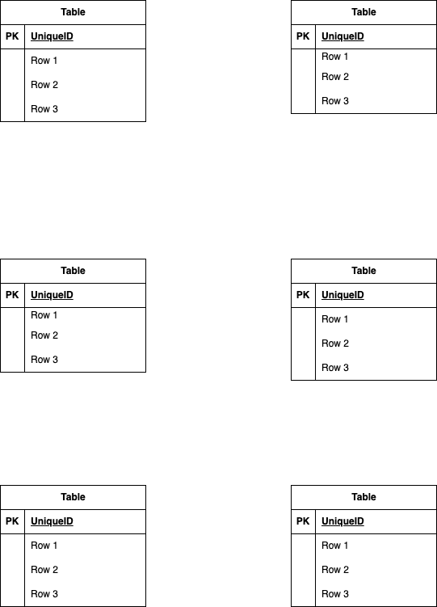

# アプリ名  
  
## アプリケーションの概要  
  
## 使用技術（実行環境）  
開発環境および使用している主要な技術スタックは以下の通りです。  
  
### 1. 開発インフラ / サーバー構成  
  
| 項目         | 技術 / バージョン                            |  
| ------------ | -------------------------------------------- |  
| インフラ     | Docker / Docker Compose                      |  
| Web サーバー | Nginx 1.21.1                                 |  
| データベース | MySQL 8.0.35                                 |  
| ツール       | phpMyAdmin (DB 管理), |  
  
### 2. バックエンド (Backend)  
  
| 項目           | 技術 / バージョン                                |  
| -------------- | ------------------------------------------------ |  
| 言語           | PHP 8.1                                          |  
| フレームワーク | Laravel 8.x                                      |  
| 認証パッケージ | Laravel Fortify (会員登録・ログイン・メール認証) |  
  
### 3. フロントエンド (Frontend)  
  
| 項目                 | 技術             |  
| -------------------- | ---------------- |  
| テンプレート | Blade            |
| スタイリング         | CSS (Native CSS) |  
  
## 環境構築手順  
クローン後、以下の手順で開発環境を起動できます。  
  
### 1.リポジトリのクローン  

```bash
git clone https://github.com/ユーザー名/プロジェクト名.git
```

```bash
cd プロジェクト名
```
### 2.環境設定ファイルの準備

```bash
cp src/.env.example src/.env
```
①DBの設定
以下のように設定されているか確認してください。
```bash
DB_CONNECTION=mysql  
DB_HOST=mysql  
DB_PORT=3306  
DB_DATABASE=laravel_db  
DB_USERNAME=laravel_user  
DB_PASSWORD=laravel_pass  
```  
  
### 3.Docker コンテナの構築・起動  

```bash  
docker-compose up -d --build  
```  
※ Windows環境（Docker Desktop）を使用している場合、ファイル実行権限の関係で storage ディレクトリの権限エラーが発生することがあります。その場合は「8. 環境構築後のログファイルへの書き込みエラー発生時」の手順を参照してください。  
  
### 4.依存パッケージのインストールとキー生成
```bash  
docker-compose exec php composer install  
```
  
```bash  
docker-compose exec php php artisan key:generate  
```

### 5.マイグレーションの実行  

```bash  
docker-compose exec php php artisan migrate  
```
  
### 6.「シンボリックリンク」の作成を追加  
ブラウザからアップロード画像等を表示できるようにするため、以下のコマンドを実行してください。  
  
```bash  
docker-compose exec php php artisan storage:link  
```  
  
### 7.初期データの投入  

開発および動作確認のため、以下の手順でダミーデータを投入してください。  

```bash
docker-compose exec php php artisan migrate:fresh --seed
```
  
データの整合性を保つため、以下の順序でシーディングを実行する構成としています。  
  
■ シーダー実行順序  
  
### 8.環境構築後のログファイルへの書き込みエラー発生時  
"The stream or file could not be opened"エラーが発生した場合は、  
Storageディレクトリにある権限を設定してください。  
```bash
chmod -R 777 storage  
```  
  
## テスト実行環境の構築  
本プロジェクトでは、開発用データベースのデータを保護するため、テスト実行時に専用のデータベース（demo_test）を使用します。  
  
### 1.テスト用データベースの作成  
MySQLコンテナ内で、テスト用のデータベース（箱）を作成します。  
  
```bash  
docker-compose exec mysql mysql -u root -p -e "CREATE DATABASE IF NOT EXISTS demo_test;"  
```  
  
### 2.テスト用環境変数の準備  
.env.testing は機密情報保護のため Git 管理から除外されています。以下の手順で作成してください。  
  
```bash  
cp src/.env src/.env.testing  
```  
  
```bash  
docker-compose exec php php artisan key:generate --env=testing  
```  
  
作成した .env.testing を開き、データベース接続先をテスト専用のものに書き換えます。  
# .env.testing の修正箇所  
```bash  
APP_ENV=testing  
```  
```bash  
DB_CONNECTION=mysql_test  
```  
  
```bash  
DB_DATABASE=demo_test  
```
  
### 3.テスト用マイグレーションの実行  
テスト用データベースにテーブル構造を作成します。  
```bash  
docker-compose exec php php artisan migrate --env=testing  
```  
  
## テストの実行方法  
以下のコマンドでテストを実行できます。  
```bash  
docker-compose exec php php artisan test  
```  
  
## 開発・管理ツール  
環境構築完了後、以下の URL から各機能にアクセスできます。  
  
| サービス名 | URL | 備考 |  
| ---- | ---- | ---- |  
| アプリケーション本体 | http://localhost | 動作確認用メインページ |  
| phpMyAdmin | http://localhost:8080 | データベース管理ツール |  
  
■phpMyAdmin 接続情報  
データベースの値を直接確認・変更する際は、以下の設定でログインしてください。  
  
サーバー名: mysql  
ユーザー名: laravel_user  
パスワード: laravel_pass  
  
## ER 図  
  
  
  
## データベース設計  
  
## モデル・リレーション定義  
  
## コントーローラー別機能定義  
各コントローラーが担当する画面と、具体的な処理内容の一覧です。  
  
## ルーティング定義  
  
## ヘッダー機能  
共通レイアウトとして、全ページ（認証画面を除く）で利用可能なナビゲーションと検索機能を提供しています。  
  
